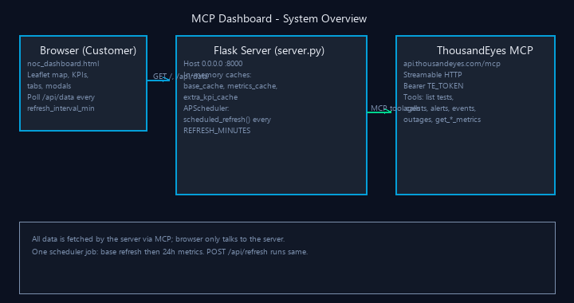
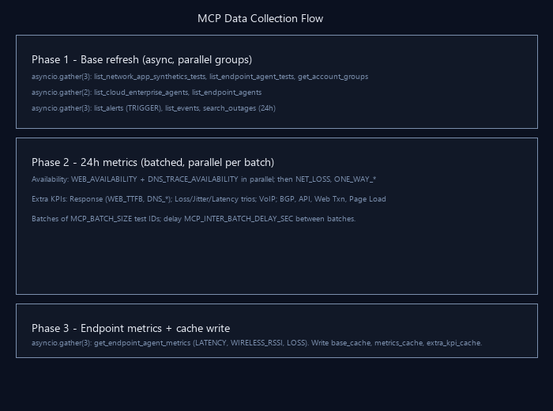
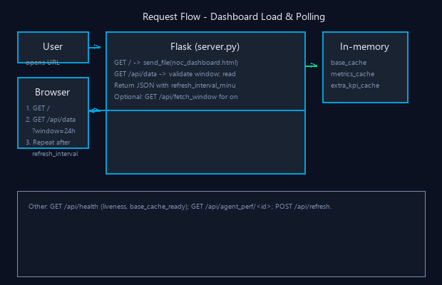
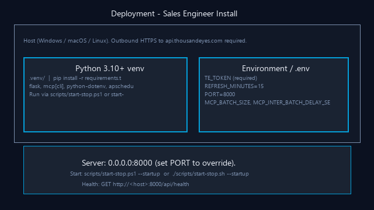

# MCP Dashboard — Technical Architecture Guide

This guide is for **sales engineers** who install, run, and demonstrate the NOC dashboard with customers. It explains how the application works end-to-end, how data flows from ThousandEyes into the UI, and how to configure and troubleshoot it.

---

## 1. Purpose and Audience

| Item | Description |
|------|-------------|
| **What it is** | A single-page NOC-style dashboard that displays live ThousandEyes data (synthetics, agents, alerts, events, outages, endpoint metrics) using the **Model Context Protocol (MCP)**. |
| **Who uses it** | Sales engineers for customer demos; optionally internal NOC teams. |
| **How data is obtained** | The **server** (Python/Flask) calls the ThousandEyes MCP API over HTTPS. The **browser** only talks to the server; it never contacts ThousandEyes directly. |

---

## 2. High-Level Architecture

The system has three main parts: the **customer’s browser**, the **Flask server** (this app), and the **ThousandEyes MCP API**.

| Component | Role |
|-----------|------|
| **Browser** | Loads `noc_dashboard.html`, renders map (Leaflet), KPIs, tabs, modals. Polls `GET /api/data?window=…` on an interval driven by the server’s `refresh_interval_minutes`. |
| **Flask server** | Serves the HTML, exposes JSON APIs, holds **in-memory caches** (base data, per-window metrics, extra KPIs), and runs an **APScheduler** job that periodically refreshes base data then 24h metrics. |
| **ThousandEyes MCP** | Streamable HTTP API at `https://api.thousandeyes.com/mcp`. Authenticated with `TE_TOKEN`. Provides “tools” such as listing tests/agents/alerts/events/outages and fetching synthetics/endpoint metrics (often in batches). |

**Important for demos:** All ThousandEyes data is pulled by the server via MCP. The browser only receives aggregated JSON from `/api/data` and optional `/api/agent_perf/<test_id>`. No customer API token is ever sent to the browser.

---

## 3. Component Overview

### 3.1 Server (`server.py`)

- **Framework:** Flask; single process, multi-threaded for request handling.
- **Concurrency:** Async MCP calls via `asyncio`; sync entrypoints (`refresh_base`, `get_or_fetch_metrics`, etc.) use `asyncio.run()` so each refresh runs in a single thread. Scheduler and `/api/refresh` run refresh logic in background threads.
- **Configuration:** All config from environment (or `.env` via `python-dotenv`). See [Section 7](#7-deployment-and-configuration).

### 3.2 Caches (in-memory, process-local)

| Cache | Contents | Populated by | TTL / invalidation |
|-------|----------|--------------|---------------------|
| **base_cache** | Tests, test IDs, agents (cloud/enterprise/endpoint), alerts, events, outages, account group name, gauges, counts | `refresh_base_data_async()` | Replaced on every base refresh (no TTL). |
| **metrics_cache** | Per-window availability-style metrics (e.g. 1h, 6h, 24h, 7d). Key = window key (`"1h"`, `"24h"`, etc.). | `fetch_metrics_async(hours)` | `METRICS_TTL_SECONDS` (derived from `REFRESH_MINUTES`; min 5m, max 60m). |
| **extra_kpi_cache** | Per-window extra KPIs: response times, loss, jitter, latency, VoIP, BGP/API/page metrics, endpoint worst performers. | `fetch_extra_kpis_async(hours)` | Same as metrics_cache. |

All cache access is protected by a single **threading lock** (`_cache_lock`) so that concurrent requests see a consistent snapshot.

### 3.3 Scheduler

- **Library:** APScheduler (background scheduler).
- **Single job:** `scheduled_refresh()` runs on an interval of **REFRESH_MINUTES** (default 15).
- **Sequence (important):**  
  1. **Base refresh** — Fetches tests, agents, alerts, events, outages, account groups via MCP and updates `base_cache`.  
  2. **Default metrics** — Fetches 24h availability and 24h extra KPIs and updates `metrics_cache["24h"]` and `extra_kpi_cache["24h"]`.

This order ensures metric fetches always use the latest test/agent IDs from the base refresh. The same sequence is used on **startup** and when **POST /api/refresh** is called.

### 3.4 Front End (`noc_dashboard.html`)

- Single HTML file with embedded CSS and JavaScript; no build step.
- **Map:** Leaflet (CDN); agent markers with popups; toggles for enterprise vs endpoint agents.
- **Data:** Fetches `GET /api/data?window=<currentWindow>`. Uses `DATA.refresh_interval_minutes` to set the next poll interval (or falls back to 15 minutes).
- **Time windows:** 1h, 6h, 12h, 24h, 2d, 7d. Changing the window can trigger an on-demand fetch via `/api/fetch_window` if the server does not already have fresh data for that window.

---

## 4. MCP Data Collection in Detail

### 4.1 Transport and Authentication

- **URL:** `MCP_URL` (default `https://api.thousandeyes.com/mcp`).
- **Auth:** HTTP header `Authorization: Bearer <TE_TOKEN>`.
- **Client:** MCP SDK `streamablehttp_client` + `ClientSession`; each tool call typically opens a streamable HTTP connection, sends the tool name and arguments, and reads JSON/CSV-style responses.

### 4.2 Base Refresh — Tools Called (Parallel Groups)

The following diagram shows the two-phase refresh: first base (parallel tool groups), then metrics (batched, with parallel metric calls per batch).

**Phase 1 — Base (single parallel batch for minimum wall time):**

All 8 base tools are run in one `asyncio.gather` so the server waits only for the slowest call:

| Tools | Purpose |
|-------|---------|
| `list_network_app_synthetics_tests`, `list_endpoint_agent_tests`, `get_account_groups` | Test catalog, endpoint test list, account group name. |
| `list_cloud_enterprise_agents`, `list_endpoint_agents` | Cloud + enterprise agents; endpoint agents. |
| `list_alerts` (state=TRIGGER), `list_events`, `search_outages` (window=24h) | Active alerts, events, outages. |

The server then builds in-memory structures: test IDs by name, agent lists with coordinates (using a built-in location lookup), alert feed, live events, parsed outages, test-type gauges, and account group name. Result is written to **base_cache**.

### 4.3 Metrics Refresh — Batched and Parallel Per Batch

- **Input:** Synthetic test IDs from `base_cache` (excluding endpoint test IDs). Split into batches of **MCP_BATCH_SIZE** (default 20).
- **Between batches:** Sleep **MCP_INTER_BATCH_DELAY_SEC** (default 0.35) to reduce rate-limit risk.
- **Within a batch:** For some metric groups, the server issues **multiple MCP metric calls in parallel** (e.g. `WEB_AVAILABILITY` and `DNS_TRACE_AVAILABILITY` together). Results are merged with a **first-wins** rule so that the same test never gets two different values for the same logical metric (merge order is deterministic).

**Availability (24h default):**

- Batches of test IDs; for each batch, parallel call:
  - `get_network_app_synthetics_metrics` for `WEB_AVAILABILITY`
  - `get_network_app_synthetics_metrics` for `DNS_TRACE_AVAILABILITY`
- Then fill gaps with `NET_LOSS` and `ONE_WAY_NET_LOSS_TO_TARGET` (availability = 100 − loss), again in batches.

**Extra KPIs (24h default):**

- **Response time:** Parallel per batch for `WEB_TTFB`, `DNS_SERVER_TIME`, `DNS_TRACE_QUERY_TIME`; first-wins merge into `resp_by_test`.
- **Loss / jitter / latency:** Similar batched parallel calls for the respective metric trios; first-wins merge.
- **VoIP:** Sequential per metric (MOS, latency, loss, PDV) over batches.
- **BGP, API, Web Transaction, Page Load:** Sequential per metric over batches.
- **Endpoint agents:** Single `asyncio.gather` of two `get_endpoint_agent_metrics` calls (ENDPOINT_TEST_NET_LATENCY, ENDPOINT_GATEWAY_WIRELESS_RSSI) by `ENDPOINT_AGENT_MACHINE_ID`.

Results are written to **metrics_cache** and **extra_kpi_cache** for the corresponding window (e.g. `"24h"`).

**Initial load performance:** On startup, the server runs base first, then runs **24h metrics** and **24h extra KPIs in parallel** (`asyncio.gather`). That reduces initial load time compared to running metrics then extra KPIs sequentially.

### 4.4 On-Demand Metrics

- **GET /api/fetch_window?window=** — If the requested window is not fresh (within TTL), the server runs `fetch_metrics_async` and `fetch_extra_kpis_async` for that window and updates the caches. Used when the user switches time window in the UI.
- **GET /api/agent_perf/<test_id>** — Single MCP call: `get_network_app_synthetics_metrics` with `group_by=SOURCE_AGENT` and `filter_dimension=TEST`, `filter_values=[test_id]`. Metric type is chosen from test type (e.g. HTTP → `WEB_AVAILABILITY`). **test_id** is validated (numeric or `ep-` prefix with safe characters) to avoid injection.

### 4.5 Retries and Rate Limiting

- Each MCP tool call is retried up to **4 times** on transient errors.
- If the MCP response indicates **429 / Too Many Requests**, the server backs off with exponential delay (2^attempt seconds, capped) before retrying.
- Logs mention tool name and attempt; **no tokens or raw response bodies** are logged.

---

## 5. API Reference (Summary)

| Endpoint | Method | Purpose |
|----------|--------|---------|
| `/` | GET | Serves `noc_dashboard.html`. |
| `/api/data` | GET | Query: `window` (1h, 6h, 12h, 24h, 2d, 7d). Returns merged base + metrics + extra KPIs for that window, plus `refresh_interval_minutes` and `metrics_ttl_seconds`. 503 if base_cache not yet loaded. |
| `/api/health` | GET | Liveness; `base_cache_ready`; `last_base_refresh`; `refresh_interval_minutes`. For load balancers or monitoring. |
| `/api/fetch_window` | GET | Query: `window`. On-demand metrics for that window if cache is stale. |
| `/api/agent_perf/<test_id>` | GET | Per-test agent breakdown; test_id validated. |
| `/api/refresh` | POST | Starts full refresh (base → 24h metrics) in a background thread; returns `{ "status": "refresh started" }`. |

All `/api/*` responses send **X-Content-Type-Options: nosniff** and **Cache-Control: no-store**.

---

## 6. Request Flow (Dashboard Load and Polling)

The following diagram shows how a user loads the dashboard and how the browser polls for data.

1. User opens `http://<host>:8000/` (or the port set by `PORT`).
2. Server responds with `noc_dashboard.html`.
3. Browser runs JavaScript: calls `GET /api/data?window=24h` (or last selected window).
4. Server reads from base_cache and, for the requested window, from metrics_cache and extra_kpi_cache; returns JSON (or 503 if base not ready).
5. UI renders map, KPIs, tabs, etc., and sets the next poll interval from `DATA.refresh_interval_minutes`.
6. After that interval, the browser calls `/api/data` again and repeats.

Optional: If the user changes the time window and the server does not have fresh data for it, the UI can call `/api/fetch_window?window=…` to trigger an on-demand metrics fetch; the next `/api/data` will then include that window’s data.

---

## 7. Deployment and Configuration

### 7.1 Deployment Topology

- **Host:** Any OS where Python 3.10+ and the dependencies run (Windows, macOS, Linux).
- **Network:** Server must have **outbound HTTPS** to `api.thousandeyes.com`. No inbound rules required if only local browser access; for remote demos, open port 8000 (or `PORT`) or put the app behind a reverse proxy (HTTPS, optional auth).
- **Process:** Run `python server.py` (or via a process manager). Server binds **0.0.0.0:8000** by default (set `PORT` to override).
- **Health:** `GET http://<host>:8000/api/health` for liveness and cache status.

### 7.2 Environment Variables

| Variable | Required | Default | Description |
|----------|----------|---------|-------------|
| **TE_TOKEN** | Yes | — | ThousandEyes API token (Bearer) for MCP. Do not commit. |
| **REFRESH_MINUTES** | No | 15 | Scheduler interval (1–120). UI uses same value from `/api/data`. |
| **MCP_URL** | No | `https://api.thousandeyes.com/mcp` | Override only if directed. |
| **MCP_BATCH_SIZE** | No | 20 | Test IDs per synthetics metrics batch (5–50). Larger = fewer round-trips, faster load; may increase 429 risk. |
| **MCP_INTER_BATCH_DELAY_SEC** | No | 0.35 | Delay (seconds) between batch rounds. Lower = faster; increase if you see 429s. |

Use a `.env` file in the project root (loaded by `python-dotenv`) and keep it out of version control. Copy from `.env.example`.

### 7.3 Python and Dependencies

- **Python:** 3.10+.
- **venv:** Create and activate; install with `pip install -r requirements.txt` (flask, mcp[cli], python-dotenv, apscheduler, httpx).

See the project **README** for exact venv and run commands per platform.

---

## 8. Security and Operational Notes

- **Credentials:** `TE_TOKEN` must be set only in environment or `.env`; never logged or sent to the browser.
- **Server role:** The server acts as a **proxy** to ThousandEyes: only the server needs the token; customers’ browsers do not.
- **APIs:** No built-in auth on Flask routes. For remote demos, use a reverse proxy (e.g. nginx, Caddy) with TLS and optional HTTP auth or VPN.
- **Input validation:** `window` is allowlisted; `test_id` in `/api/agent_perf/<test_id>` is validated by regex.
- **Logging:** Structured log messages; no secrets or full response bodies. Safe for operational troubleshooting.

---

## 9. Troubleshooting

| Symptom | Check |
|--------|--------|
| **503 on /api/data** | Base cache not yet loaded. Wait for first scheduler run or call POST /api/refresh and wait. Check logs for MCP errors. |
| **Empty or stale data** | Confirm `TE_TOKEN` is set and valid. Check outbound HTTPS to api.thousandeyes.com. Review logs for 429/retries or tool errors. |
| **Slow first load** | First base + 24h metrics run can take tens of seconds depending on account size. Subsequent loads are served from cache. |
| **Rate limits (429)** | Increase `MCP_INTER_BATCH_DELAY_SEC` or decrease `MCP_BATCH_SIZE`. Ensure only one instance is running. |
| **Wrong refresh interval in UI** | UI reads `refresh_interval_minutes` from `/api/data`. Ensure server was started with desired `REFRESH_MINUTES`. |
| **Health check fails** | GET /api/health; if `base_cache_ready` is false, base refresh has not completed yet or failed (check logs). |

---

## 10. Diagram Files (PNG)

All diagrams are in **docs/diagrams/** as PNGs and render reliably on GitHub and in docs. To regenerate them, run `pip install -r requirements-diagrams.txt` and `python scripts/generate_diagrams.py` from the project root.

| File | Description |
|------|-------------|
| **01-system-overview.png** | Browser, Flask server (caches, scheduler), ThousandEyes MCP; data flow. |
| **02-mcp-collection-flow.png** | Phase 1 (base tools, parallel groups); Phase 2 (batched metrics, parallel per batch); Phase 3 (endpoint metrics, cache write). |
| **03-request-flow.png** | User → browser → Flask → caches; polling loop; other API endpoints. |
| **04-deployment.png** | Host, venv, env vars, server bind and health check. |

---

*Document version: 1.0 — for use by sales engineers installing and demonstrating the MCP NOC dashboard with customers.*
